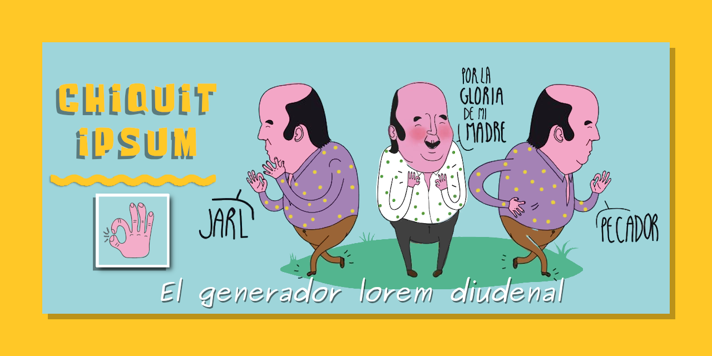

# CHIQUIT IPSUM



Jarl fistro, ¡¡pecador de la pradera!!

Equí un generador diodenal de frases aleatorias que te va a hacer pupita de la pradera. Cuidaor, que vienen la benemeritar, va usté muy cargadoo y te va a borrar el cerito, tatuando siete caballos de bonanzar!

¡¡¡No puedor!!! 😆😆😆


## Ideas

- 🚧 Frontend:
  - Progressive Web App (PWA) moderna escrita en HTML5, CSS3, Javascript ES6 puro, teniendo en cuenta la accesibilidad WCAG / WAI-ARIA y la semántica como punto primordial.
- 🚧 Backend:
  - Api web pública desplegada en la nube para generar frases aleatorias.
- 🚧 Utilities:
  - IDE's add-ons integrados (Visual Studio Code...). Escribe la palabra `fistro` seguido del número de palabras a generar y tendras tu texto aleatorio. Ejemplo: `fistro20`:
    ```
    Cuidao pecador!! Viene la benemeritar, va usté muy cargadoo y te va borrar el cerito tatuandote siete caballos de bonanzar!
    ```


## Cómo contribuir

Si te interesa la idea 💡 o quieres información ℹ️ sobre como agregar cualquier contenido, por favor lee primero el [fichero CONTRIBUTING](CONTRIBUTING.md).


## Licencia

EL contenido de este proyecto y el código fuente usado para formatear y mostar cualquier contenido está está licenciado bajo [The GNU Affero General Public License Version 3](LICENSE).
